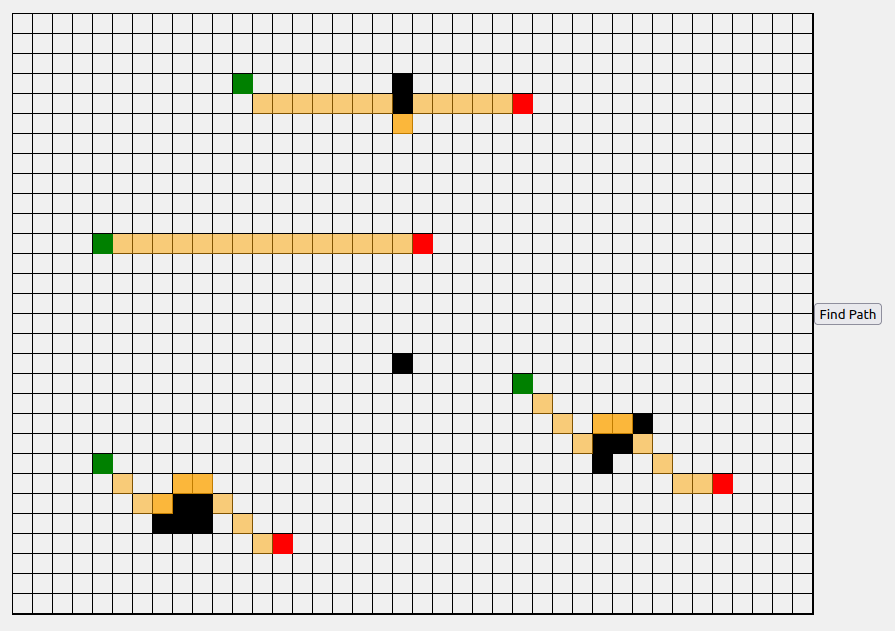

# A fun project to experience java services and javascript

This project provides an interactive grid-based interface for users to select start and end points, as well as obstacles, and then find a calculated path between the selected points. The backend path planning algorithm is implemented in Java and is connected to the frontend interface using endpoints.

## Features

1. **Grid Creation**: Create a grid with a constant width in both the x and y axes.

2. **User Interaction**: Interact with the grid by selecting cells and clicking buttons to designate start, end, and obstacle cells.

3. **Path Planning Algorithm**: Utilize a Java-based path planning algorithm to find the optimal path between the selected start and end points while considering obstacles.

4. **Communication via Endpoints**: Establish communication between the Java backend and the frontend JavaScript code through defined endpoints.

5. **Visualization**: Visualize the calculated path obtained from the Java service on the grid interface.

## Getting Started 

To get started with the project, follow these steps:

1. Clone the repository to your local machine.

2. Set up the backend Java service by running the provided setup script. (*TODO*)

3. Run the frontend JavaScript code in your preferred web browser with `run.sh` script.

4. Interact with the grid interface to select start and end points, as well as obstacles.

5. Click the "Find Path" button to trigger the Java path planning algorithm and visualize the calculated path on the grid.

## Contributing

Contributions are welcome!
